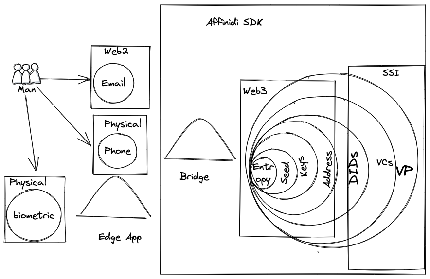

# Welcome to Self Severing Identity with Affinidi SDK
## Why SSI and web5
- User centric decentralized world or democratized and unlocked data
- Allow to create privacy preserving applications
- Allow to create holistic identity metasystem 
## SSI Principles 

In 2005, Microsoft's Chief Identity Architect, Kim Cameron wrote an influential paper called [The Laws of Identity](https://www.identityblog.com/stories/2005/05/13/TheLawsOfIdentity.pdf) (PDF). Kim had been talking about and formulating these laws in 2004 and throughout 2005. It's no coincidence that Internet Identity Workshop got started in 2005. Many people were talking about user-centric identity and developing ideas about how we might be able to create an identity layer for the Internet. Fifteen years later, we're still at it, but getting closer and closer all the time.

[laws of identity](https://www.windley.com/archives/2019/01/the_laws_of_identity.shtml) is iconic paper that explain how to build a future of identity systems 
### For Data unlocking and Ownership

<iframe src="https://www.youtube.com/embed/_2VRD9skrlc" class="responsive-iframe" title="YouTube video player" frameborder="0" allow="accelerometer; autoplay; clipboard-write; encrypted-media; gyroscope; picture-in-picture" allowfullscreen></iframe>

## Affinidi SDK
Affinidi SDK offer multiple capabilities and features for self sovereign identity management 

Code could be found in a repo [Affinidi SDK repo](https://github.com/affinidi/affinidi-core-sdk)

we build a bridges from web2 to web3

Lets try to connect all dots together 

<iframe src="https://www.youtube.com/embed/owbkzvLhblk" class="responsive-iframe" title="YouTube video player" frameborder="0" allow="accelerometer; autoplay; clipboard-write; encrypted-media; gyroscope; picture-in-picture" allowfullscreen></iframe>

## What about Web 5 ?

<iframe src="https://www.youtube.com/embed/WGrmyyewLFY" class="responsive-iframe" title="YouTube video player" frameborder="0" allow="accelerometer; autoplay; clipboard-write; encrypted-media; gyroscope; picture-in-picture" allowfullscreen></iframe>
